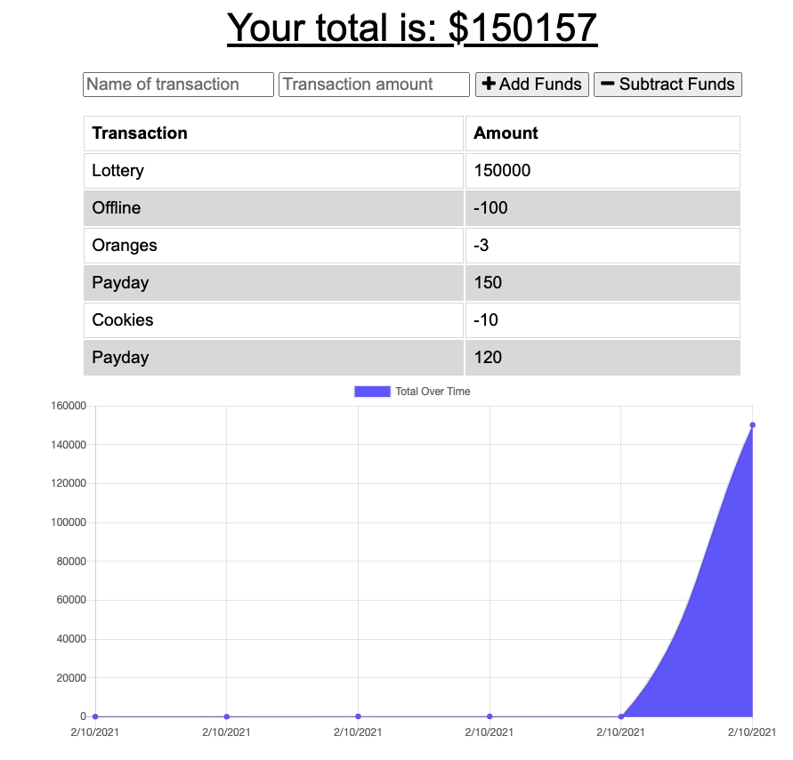

# Online/Offline Budget Tracker

## Description
  
Add functionality to our existing Budget Tracker application to allow for offline access and functionality.

[GITHUB Link to Project](https://github.com/MarioReid/budget-tracker)
[Link to Deployed Project](https://shielded-stream-84806.herokuapp.com/)

## Budget Tracker

## Table of Contents
- [Description](#description)
- [Installation](#installation)
- [Usage](#usage)
- [Contributing](#contributing)
- [Tests](#tests)
- [License](#license)
- [Questions](#questions)
  
## Installation
 The user will be able to add expenses and deposits to their budget with or without a connection. When entering transactions offline, they should populate the total when brought back online.

## Usage

* Use [Express](https://www.npmjs.com/package/express) Fast, unopinionated, minimalist web framework for node.

* Use [Mongoose](https://mongoosejs.com/docs/) MongoDB is a source-available cross-platform document-oriented database program. Classified as a NoSQL database program, MongoDB uses JSON-like documents with optional schemas. MongoDB is developed by MongoDB Inc. and licensed under the Server Side Public License..

* Use [Compression](https://www.npmjs.com/package/compression) decreases the downloadable amount of data that's served to users.

## Contributing
  
Find me on GitHub: [MarioReid](https://github.com/MarioReid)

Email me with any questions: mario.reid83@gmail.com

### License

[Apache](https://choosealicense.com/licenses/apache-2.0/) license